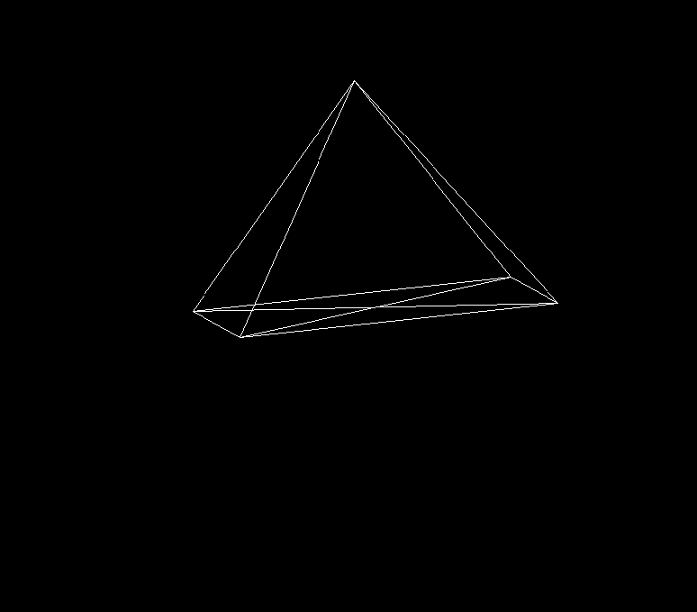

# 3DTransformations
Some C++ to help me understand how 3D objects are drawn in 2D. This project requires [PixelGameEngine](https://github.com/OneLoneCoder/olcPixelGameEngine/).
Currently hardcodes a pyramid and rotates the shape and the view.

